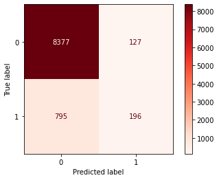

# [ANN] To Deposit or Not Deposit? -Customer Segmentation-
 Hi guys good to see you again! This would be my third project where I build a neural network model that helps to predict whether a customer would invest in a term deposit at a bank which would be extremely helpful in providing guidance or maneuver a company's bussiness strategy. Credits to [Kunal Gupta](https://www.kaggle.com/kunalgupta2616) for the [dataset](https://www.kaggle.com/datasets/kunalgupta2616/hackerearth-customer-segmentation-hackathon)! Without further ado lets begin:
 
 # Model Accuracy
 This model has achieved **90%** accuracy: (1-Subscribe term deposit, 0-**NOT** subscribing term deposit)
 
 |    Classification Report     |       Confusion Matrix       |
 |------------------------------|------------------------------|
 |||

## Performance Plot
Accuracy plot and loss plot is displayed on [Tensorboard](https://www.tensorflow.org/tensorboard) as shown below: 

# Model Architecture
The model is constructed with **2 hidden layers (64 and 32 nodes)**, with added **Dropout** and **BatchNormalization** on both layers:

Optimizer, validation methods and callback parameters are as such:

# Dataset Summary
Dataset consist of 31647 rows of observatitions and 18 columns:

`Index(['id', 'customer_age', 'job_type', 'marital', 'education', 'default',
       'balance', 'housing_loan', 'personal_loan', 'communication_type',
       'day_of_month', 'month', 'last_contact_duration',
       'num_contacts_in_campaign', 'days_since_prev_campaign_contact',
       'num_contacts_prev_campaign', 'prev_campaign_outcome',
       'term_deposit_subscribed'],
      dtype='object')`
      
## Null Values
`'days_since_prev_campaign_contact'` has highest number of null values, followed by `'customer_age','balance','last_contact_duration', 'marital','personal_loan','num_contacts_in_campaign'`. NaNs account for 82% in `'days_since_prev_campaign_contact'` column hence will be dropped.

## Negative Values
Negative values observed in `balance` column however it is acceptable as cases of overdraft accounts.

## Duplicates
No duplicate observation is observed in dataset.

## Label Proportions
Dataset is not balanced:

## Observations
Some early observations pulled from graphs:
- Participants mostly in age range 30-40.
- Most participants has balance of less than 10000.
- Highest success rate appears to be in May-Aug.
- Most participants who subsribed term deposit has secondary/tertiary 
  education.
- Participants who are on housing/personal loan not likely to have 
  term deposit.
- Promotional strategy via cellular has highest success rate to 
  subscribe term deposit. 

# Data Cleaning
Few steps taken to clean data:
- Numerize categorical columns using `LabelEncoder()`
- Drop `'id'` and `'days_since_prev_campaign_contact'` columns 
- Impute null values using `IterativeImputer()`

# Feature Selection
**Logistic Regression** and **Cramer's V** are used to analyse correlation of **numeric** and **catagorical features** respectively to target column:

|           Logistic Regression        |             Cramer's V               |
|--------------------------------------|--------------------------------------|
|||
|All numeric features listed in `'num_data'` displayed at least 89% accuracy, inferring the numeric features have good correlation to target feature| Since all categorical features display negligible to weak correlation to output they will be discarded|

# Preprocessing
2 steps involved in preprocessing:
- Expanding columns of target feature into 2 using `OneHotEncoder()` since output is binary.
- Create train and test dataset using `train_test_split()`

# Discussion
Much to my surprise `'communication_type','education', 'housing_loan','personal_loan'` are not important features for the model. Instead, `'day_of_month'` turned out to be one of the important feature that is something beyond my comprehension. :sweat_smile: 

Nevertheless it has served as a mathematical proof that day of month plays an important part in scoring a term deposit subscription. Weak correlation among other features may be affected by unbalanced dataset, hence it is suggested to:
- [ ] Apply SMOTE method to allow equal proportion of classes in dataset.

